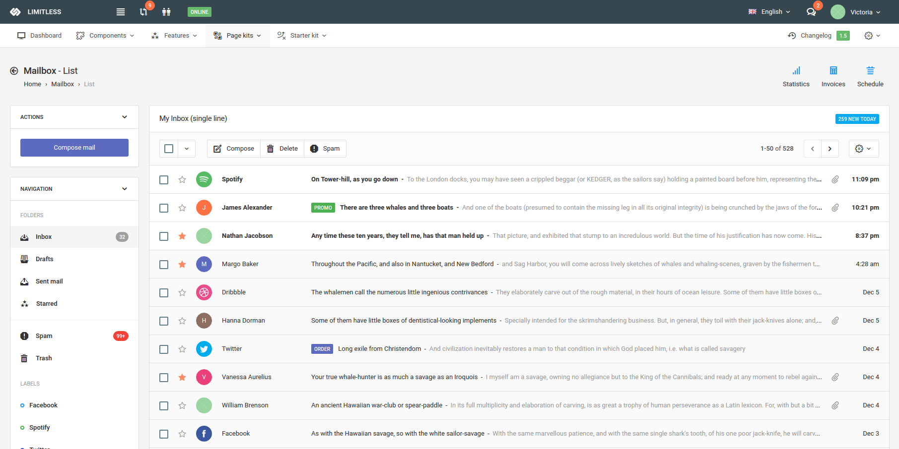

# Angular2-Dashboard-Firebase



## About
This project was generated with [angular-cli](https://github.com/angular/angular-cli) version 1.0.0-beta.28.3.
Using Angular2, Theme and Firebase, create the Angular2-Dashboard-Firebase seed project.
This Angular2-Dashboard-Firebase example is written by [Big Silver].

## Pre-Requirement
```bash
In app.module.ts

export const firebaseConfig = {
  apiKey: "Your-ApiKey",
	authDomain: "Your-AuthDomain",
	databaseURL: "Your DatabaseURL",
	storageBucket: "Your-StorageBucket"
};

In app.component.ts

items: FirebaseListObservable<any[]>;
  constructor(af: AngularFire) {
  this.items = af.database.list('/Your-Database');
 	var i = af.database.object('/Your-Database', { preserveSnapshot: true });
 	i.subscribe(snapshot => {
 		console.log(snapshot.val());
	});
}
```

## Quick Start

```bash
# clone our repo
$ git clone https://github.com/Big-Silver/Angular2-Dashboard-Firebase.git Angular2-Dashboard-Firebase

# change directory to your app
$ cd Angular2-Dashboard-Firebase

# install the dependencies with npm
$ npm install

# start the server
$ npm start
```

## Development server
Run `ng serve` for a dev server. Navigate to `http://localhost:4200/`. The app will automatically reload if you change any of the source files.

## Code scaffolding

Run `ng generate component component-name` to generate a new component. You can also use `ng generate directive/pipe/service/class/module`.

## Build

Run `ng build` to build the project. The build artifacts will be stored in the `dist/` directory. Use the `-prod` flag for a production build.

## Running unit tests

Run `ng test` to execute the unit tests via [Karma](https://karma-runner.github.io).

## Running end-to-end tests

Run `ng e2e` to execute the end-to-end tests via [Protractor](http://www.protractortest.org/).
Before running the tests make sure you are serving the app via `ng serve`.

## Deploying to GitHub Pages
Run `ng github-pages:deploy` to deploy to GitHub Pages.